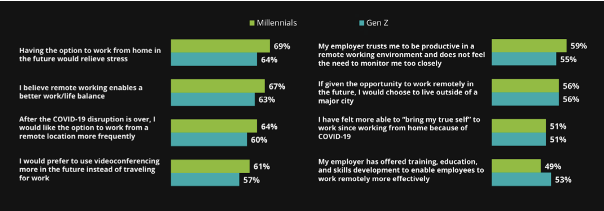

Recently Deloitte made the Global Survey[1](#additional-reading) which explores the views of more than 27,500 Millennials and Gen Zs about their stress level, attitude towards remote work, individual responsibility, pandemic, and other topics.

In the article, I'd like to share some most important insights into the survey and my opinion about them because understanding the views of our generation regarding different topics might help to understand the direction we are going to go.

## Table of contents

- Part 1. [Remote 2.0 (The changing nature of work)](#remote-20-the-changing-nature-of-work)
- Part 2. [Decentralization](#decentralization)
- Part 3. [Stress and Personal Anxieties](#stress-and-personal-anxieties)
- Part 4. [Individual Responsibility](#individual-responsibility)
- [Additional Reading](#additional-reading)

## Remote 2.0 (The changing nature of work)

The survey among 27,500 respondents shows that 2/3 of millennials and Gen Zs would like to have an option to work remotely. I must admit that I personally also notice the tendency across a lot of IT specialists on social networks, conferences and discussions started to speak about challenges and opportunities that remote work brought to us. As you can see from the charts below respondents say that remote work relieves their stress and enables a better work/life balance.

Although remote work has some challenges (going to write about it in near future, so [subscribe](https://t.me/oganisyancom) to blog to stay tuned ^_^), I think the post-pandemic world is going to be remote-friendly and need to start to bring some best-practices how to resolve issues like asynchronous chatting, online meetings, human communication, etc.

At the same time, companies like Twitter announced that they are going to have remote-first (keeping office spaces too) approach even after pandemic so in near future we might have examples of remote-friendly environments even among companies with more than 4 thousand employees.

This is the challenge for a lot of businesses because now they should change their management practices. And if in "previous" world it was easier to have things done just because humans are able to self-organize, in remote-first environment companies will face issues connected to their processes and management.

## Decentralization

Past decades have created centralized environments near big cities like New York, Moscow, Shanghai, and regions like Silicon Valley. It makes impossible for us to live outside of the big cities and work with the best companies, universities and on the projects. Hence people started to leave small countries and towns and the difference between the strongest of the world and others. Employers also face issues connected to abnormal salaries and competition among specialists in those big cities and regions. Companies are also unable to reach the best professionals because of the territorial location (and vice verse).

For now, the survey shows that more than half of respondents would prefer to live outside of a major city in case of opportunity to work remotely. And if businesses start to give such an opportunities I guess in the near future we are going to see the decentralization of the world and tons of specialists, companies, and universities all over the world will be able to cooperate.

## Stress and Personal Anxieties

Another important topic is stress and anxieties. Survey shows that almost 50% of all millennials and Gen Zs facing daily stress and the main reasons for anxieties are family welfare, financial future and job/career prospects, social networks (FOMO), and many others. In my opinion, one of the main tasks of Gen Z is to improve the ways we handle our stress in the world where one needs to consume more information that he can ever handle.

For now, I'd recommend to read more about [concentration and flow mode](../top-apps-for-concentration/) and try to apply them into daily life.

## Individual Responsibility

Events across the whole world: debates regarding constitutional changes in Russia, #blacklivesmatter movement in the USA, and many others showing us that people in the post-pandemic world are started to realize the importance of individual responsibility. People started to sympathize with the needs of others and most importantly the needs of themselves. 

The chart below shows that a lot of people were inspired to make positive changes in their life after the pandemic.

Sadly, we still need tragic events like COVID-19 to start thinking on topics like individual responsibility, sympathy and wishes to change the environment that we live in. Anyway, I hope that at least these events will make us be more responsible for our lives.

### Additional Reading

Below you can find a link to the actual survey. I'd recommend to give some time and explore it.

[1] [Deloitte Millennial and Gen Z survey](https://www2.deloitte.com/global/en/pages/about-deloitte/articles/millennialsurvey.html)